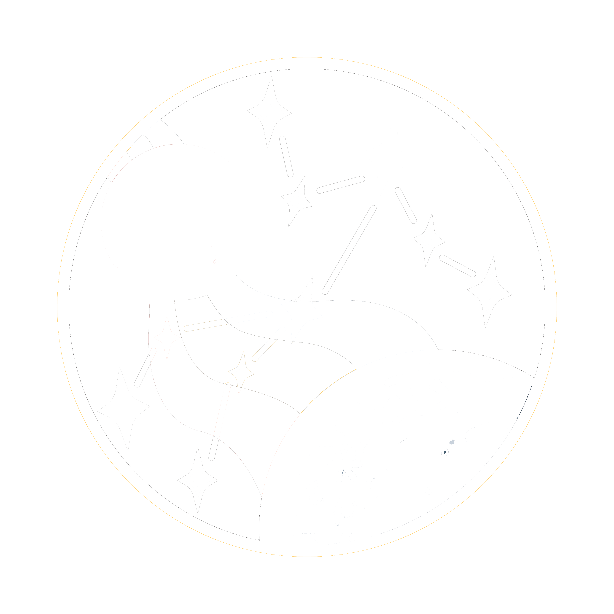

<!-- PROJECT SHIELDS -->
<!--
*** I'm using markdown "reference style" links for readability.
*** Reference links are enclosed in brackets [ ] instead of parentheses ( ).
*** See the bottom of this document for the declaration of the reference variables
*** for contributors-url, forks-url, etc. This is an optional, concise syntax you may use.
*** https://www.markdownguide.org/basic-syntax/#reference-style-links
-->

<!-- PROJECT LOGO -->
 

  

  <h3 align="center">NASA-Balance-Prototype</h3>

  

    The program for the Starchaeologist game, interfacing with hardware components, and 2 way communication server. 
  

<!-- TABLE OF CONTENTS -->

  
Table of Contents

  <ol>
    <li>
      <a href="#about-the-project">About The Project</a>
      <ul>
        <li><a href="#built-with">Built With</a></li>
        <li><a href="#Part List">Part List</a></li>
      </ul>
    </li>
    <li><a href="#How to Run">How to Run</a></li>
    <li><a href="#contact">Contact</a></li>
  </ol>

<!-- ABOUT THE PROJECT -->
## About the Project

Project Link: [https://github.com/MSD-RIT-NASA](https://github.com/MSD-RIT-NASA)

 We are a NASA-funded Multidisciplinary Senior Design (MSD) team who are making balancing testing devices to measure the balance capabilities of astronauts and track the change of the balance over time. An important aspect of the project is to gamify the test so that users are both significantly challenged while partaking in a fun experience. To do this we are utilizing virtual reality and a moving platform or balance board. The user will be on the platform/board and will be playing one of the levels where they are going through an Indiana Jones type adventure. While the users are exploring forgotten tombs, rafting down rapids, and riding minecarts, the platform on which they will be standing will move in real-time to the game experiences or the balance board will be needed to turn to the game. There are several safety precautions to make sure the users do not get injured during game use. After the level is complete, there will be a score given to the user to evaluate the balance and save it to their user profile. In future use, the difficulty will scale to the user's capabilities. https://www.nasa.gov/feature/nasa-selects-university-teams-to-develop-moon-mars-mission-design-ideas

(<a href="#top">back to top</a>)

### Built With

(<a href="#top">back to top</a>)

<!-- Component List -->
### Part List

Name | Purchase Link
--- | ---

<!-- How to Run the program -->
## How to Run

Setup: 

    1. Install Python 3.10.6 (newer versions are untested)
    2. Run setup.bat   
    3. Follow SlimeVR Docs (https://docs.slimevr.dev/) to set up PLANETs with SlimeVR Server

To run the program with BASE: (levels 1 and 2)

    1. Connect kill switch and sensors to COM ports. Adjust COM numbers as needed in GUI.   
    2. Connect to drivers with ethernet cable.
    3. Run run.bat.
    4. Select the 'BASE Levels' button.
    5. Click 'Start Server'.
    6. Click 'Launch Game'. 

To run the program with PLANETs: (level 3)

    1. Connect PC to MSD_ISS Raspberry Pi WiFi network
    2. Turn on balance board sensor. Wait until light turns from white -> blue (connecting to wifi) -> light green (waiting for server connection). 
    3. Double click run.bat.
    4. Select the 'BASE Levels' button.
    5. Click 'Start Server'.
    6. Click 'Launch Game'. 
    7. Once balance board LED is green, controller data is being sent to the PC.

(<a href="#top">back to top</a>)

<!-- CONTACT -->
## Contact

Name | Major | email | github | year
--- | --- | --- | --- | ---
Angela Hudak | CE | ach2414@rit.edu | angelahudak | 2023
Corey Sheridan | CE | cjs5445@rit.edu | cjs5445 | 2023
Noah Flanders | GDD | npf9700@rit.edu | npf9700 | 2023
Deen Grey | GDD | dbg9180@rit.edu | dbg9180 | 2023
Daniel Joseph | GDD | dj5235@g.rit.edu | TheBostonGoblin | 2023
Chayanne Quezada | GDD | crq4376@g.rit.edu | --- | 2023
Jordan Cincotti | MECE | juc5327@rit.edu | --- | 2023
Andrew Klotz | MECE | akk3949@rit.edu | --- | 2023
Nathaniel Fisher | BME | naf2291@rit.edu | --- | 2023
Nicholas Doherty | BME | nbd2354@rit.edu | --- | 2023
William Johnson | CE | williamj1999@comcast.net | WCJ7833 | 2022

<!-- MARKDOWN LINKS & IMAGES -->
<!-- https://www.markdownguide.org/basic-syntax/#reference-style-links -->

[block-diagram]: images/block_diagram.png
[schematic]: images/schematic.png
[front-3dview]: images/front_v1.PNG
[back-3dview]: images/back_v1.PNG

